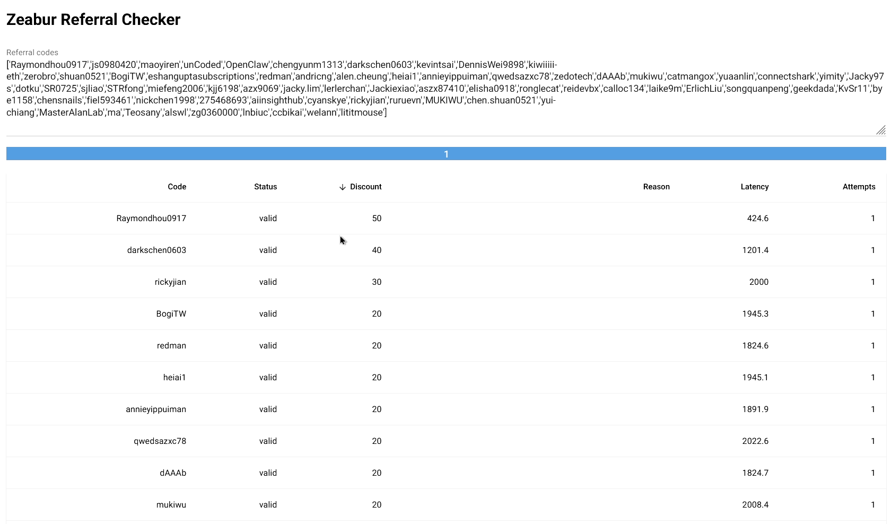

# Zeabur Referral Checker

Asynchronous referral-code validation through [Zeabur](https://zeabur.com/)'s
[GraphQL](https://graphql.org/) endpoint. The project provides a
[Python](https://www.python.org/) API, a
[Rich](https://github.com/Textualize/rich) CLI, a
[Textual](https://github.com/Textualize/textual) terminal interface, and a
[NiceGUI](https://nicegui.io/documentation/) browser/native interface.

Use it only for referral codes and accounts you are authorized to test. Keep
concurrency and request rates within the service's terms.

## Screenshots



## Requirements

- [Python](https://www.python.org/) 3.12 or newer
- [Astral uv](https://docs.astral.sh/uv/)

## Install

```bash
uv sync
```

For development tools:

```bash
uv sync --all-groups
```

## Run

Before running a check, set `REFCHECK_COOKIE` to a non-empty, authorized Cookie
header value in your environment or untracked `.env` file. The value is required;
do not include the `Cookie:` header name. Missing or rejected authentication stops
the run immediately, so refresh the cookie before retrying.

Validate a Python list:

```bash
uv run refcheck check '["CODE1", "CODE2"]'
```

The CLI also accepts comma-separated or line-separated codes:

```bash
uv run refcheck check 'CODE1,CODE2' --concurrency 8 --rate 4
```

Export results:

```bash
uv run refcheck check '["CODE1", "CODE2"]' --output results.json
uv run refcheck check '["CODE1", "CODE2"]' --output results.csv
```

Launch the terminal interface:

```bash
uv run refcheck tui
```

Launch the browser interface:

```bash
uv run refcheck gui
```

Expose the browser interface for container or remote deployment:

```bash
uv run refcheck gui --host 0.0.0.0 --port 8080
```

Use `--native` to request a native window when the platform supports it.

## Python API

```python
import asyncio

from referral_checker import validate_referral_codes


async def main() -> None:
    summary = await validate_referral_codes(["CODE1", "CODE2"])
    for result in summary.results:
        print(result.code, result.status, result.discount_percent, result.reason)


asyncio.run(main())
```

Results preserve normalized input order. Blank entries are removed and
duplicate codes are checked once.

## Configuration

Copy `.env.example` to `.env` or set `REFCHECK_*` environment variables. Fill in
the required `REFCHECK_COOKIE` with the complete Cookie header value, without the
`Cookie:` prefix.

| Variable | Default | Purpose |
|---|---:|---|
| `REFCHECK_ENDPOINT` | `https://api-bunny.zeabur.com/graphql` | GraphQL endpoint |
| `REFCHECK_ORIGIN` | `https://zeabur.com` | Origin and referer headers |
| `REFCHECK_LOCALE` | `en-US` | Zeabur locale header |
| `REFCHECK_ORDER_TYPE` | `RENT_SERVER` | Referral validation order type |
| `REFCHECK_CONCURRENCY` | `8` | Maximum concurrent validations |
| `REFCHECK_REQUESTS_PER_SECOND` | `4` | Request-rate limit |
| `REFCHECK_TIMEOUT_SECONDS` | `15` | Request timeout |
| `REFCHECK_RETRIES` | `3` | Attempts for transient transport failures |
| `REFCHECK_COOKIE` | required | Non-empty authorized session cookie |

Never commit `.env`, cookies, tokens, real referral-code lists, or browser HAR files.

## Exit codes

| Code | Meaning |
|---:|---|
| `0` | At least one valid code and no request errors |
| `1` | No valid code and no request errors |
| `2` | Invalid input or at least one request error |

## Development

Apply formatting and safe automated fixes:

```bash
uv run python scripts/quality.py format
```

Run the complete local gate:

```bash
uv run python scripts/quality.py
```

Run tests only:

```bash
uv run python scripts/quality.py test
```

The complete gate checks [Ruff](https://docs.astral.sh/ruff/),
[isort](https://pycqa.github.io/isort/),
[Pylint](https://pylint.readthedocs.io/en/latest/),
[mypy](https://mypy.readthedocs.io/en/stable/),
[Pyright](https://microsoft.github.io/pyright/),
[Bandit](https://bandit.readthedocs.io/en/latest/),
[pyscn](https://ludo-technologies.github.io/pyscn/), and
[pytest](https://docs.pytest.org/en/stable/), plus dependency-vulnerability
checks with [pip-audit](https://github.com/pypa/pip-audit) and package builds
with [uv build](https://docs.astral.sh/uv/reference/cli/#uv-build).
[GitHub Actions](https://docs.github.com/actions) runs the full gate on
[Python](https://www.python.org/) 3.12 and compatibility tests on Python 3.13,
Python 3.14, Windows, and macOS.

See [CONTRIBUTING.md](CONTRIBUTING.md) and [SECURITY.md](SECURITY.md) before
submitting changes or reporting a vulnerability.
